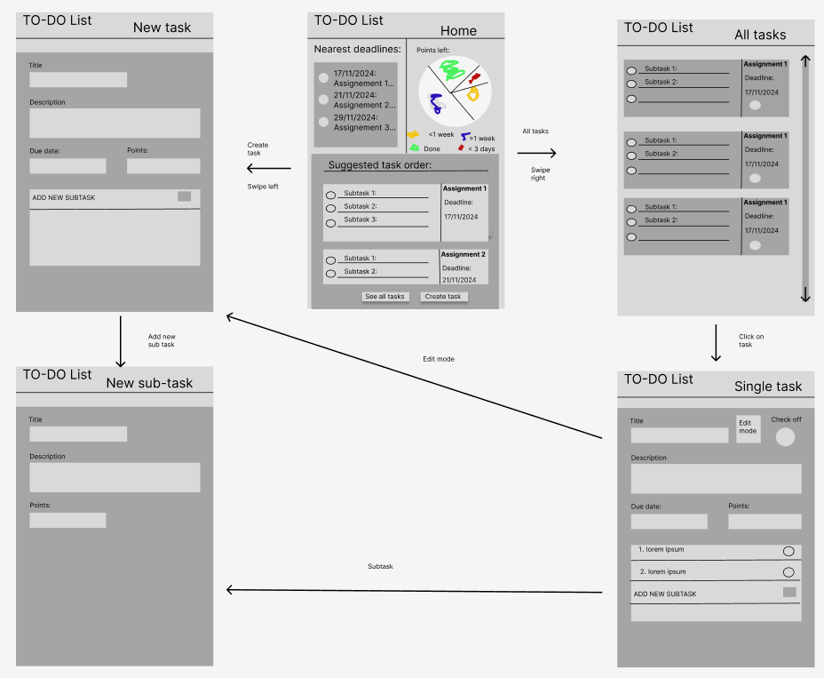

# To-Do List Application

This is a solo project developed to learn and implement the **MVVM (Model-View-ViewModel)** design pattern. It is a simple yet feature-rich to-do list application designed for personal task management.

## Features

### Must-Have Features (Implemented ✅)
- **Task Creation**: Users can create new tasks with the following attributes:
  - Title
  - Description
  - Subtasks
  - Points
  - Deadline
  - Creation date
- **Subtask Management**:
  - Add subtasks to a main task (with similar attributes as a task).
  - Check off subtasks to track progress.
  - Delete subtasks individually.
- **Task Progress**:
  - View the overall progress of a main task based on completed subtasks.
- **Task Deletion**: Delete main tasks.
- **Task Editing**: Edit fields in tasks and subtasks.
- **Task Overview**: A specialized view to display the most important tasks and subtasks in order of priority.
- **Priority Calculation**: A custom formula calculates task importance based on:
  - Deadline
  - Severity
  - SubTasks points 
- **Local Storage**: Tasks and subtasks are saved locally.

### Should-Have Features (Planned 🚧)
- Better error-handling for missing values when adding tasks
- Re-ordering of sub-tasks

### Could-Have Features (Future Ideas 💡)
- AI Assistance:
  - Use ChatGPT to split tasks into subtasks.

## Application Sketch

Below is a conceptual wireframe of the application showcasing its navigation and core features:



### Navigation Flow:
1. **Home Screen**:
   - Displays the nearest deadlines and the most important tasks in order.
   - Includes an option to create a new task or view all tasks.
2. **Task Management**:
   - Create a new task, add subtasks, or edit existing tasks.
   - Track progress through a dedicated single-task view.
3. **All Tasks View**:
   - View a list of all tasks and their associated subtasks.

## Development Details

- **Purpose**: Learn and apply the **MVVM pattern** in a practical project.
- **Tech Stack**: The application is built with a focus on **local storage** and **prioritization algorithms**.
- **Progress**: All **Must-Have** features have been implemented.

## Installation and Usage

1. Clone the repository:
   ```bash
   git clone https://github.com/your-username/todo-list-app.git
   cd todo-list-app
